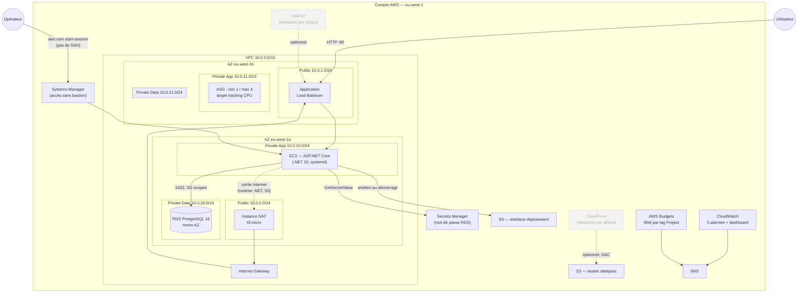

# Application web scalable sur AWS — projet de graduation SAA

Projet de fin de parcours **AWS Solutions Architect Associate (Manara)** :
déploiement d'une application web hautement disponible et scalable sur AWS,
intégralement décrite en Terraform et livrée par GitHub Actions. Aucune
ressource n'est créée à la main, à l'exception du backend de state.

**Statut : session 5 sur ~5 — infrastructure et CI/CD déployés et testés en
conditions réelles.** Les 5 modules applicatifs tournent sur AWS en
`eu-west-1` (VPC, ALB, ASG, RDS, S3, SNS, alarmes, budget). La CI/CD GitHub
Actions par OIDC est en place, avec deux rôles IAM séparés par privilège
(lecture seule sur PR, lecture/écriture sur push `main`), aucune clé longue
durée — **et réellement vérifiée** : `apply.yml` a tourné avec succès sur un
vrai push sur `main`, `plan.yml` sur une vraie pull request de test. Cinq
lacunes de scoping IAM, invisibles en local, n'ont été découvertes que par
ces runs réels et sont documentées telles quelles dans
[ADR-003](docs/adr/003-cicd-oidc-deux-roles.md).

**L'application ASP.NET Core (`app/`) est déployée en production et vérifiée
de bout en bout** : `curl` sur l'ALB confirme `/`, `/health` et `/db-check`
tous `200`, ce dernier avec une vraie connexion RDS
(`{"status":"ok","latency_ms":396}`). Publication via bucket S3 dédié +
service systemd (`make deploy-app`). Une panne réelle rencontrée au premier
déploiement — .NET refusait de démarrer sur AL2023 minimal, faute de
`libicu` — corrigée en `InvariantGlobalization`, invisible en local (Windows
n'a pas ce problème). Détail dans [`app/README.md`](app/README.md).

**Pourquoi `eu-west-1` et pas `eu-west-3` :** le compte AWS utilisé est en
"Free Plan", qui plafonne le nombre d'instances RDS **par région**,
indépendamment du crédit disponible et des quotas de service classiques.
`eu-west-3` était déjà à son plafond à cause de deux autres projets sur le
même compte ; `eu-west-1` (également UE, conforme RGPD) ne l'était pas.
Diagnostic complet, preuve CLI et alternatives écartées dans
[ADR-002](docs/adr/002-region-eu-west-1.md).

**Profil par défaut : économie maximale.** `nat_mode = "instance"`,
`enable_waf = false`, `enable_cloudfront = false`, `asg_min_size = 1`,
`multi_az = false`. Voir la section « Coûts estimés » pour les compromis que
ces défauts impliquent et comment basculer vers un profil de démonstration.

---

## Vue d'ensemble

| | |
|---|---|
| Région | `eu-west-1` (Irlande) — cf. [ADR-002](docs/adr/002-region-eu-west-1.md) |
| Zones de disponibilité | 2 (`eu-west-1a`, `eu-west-1b`) |
| Runtime applicatif | ASP.NET Core sur EC2 (Amazon Linux 2023) |
| Base de données | RDS PostgreSQL 16 |
| Terraform | ≥ 1.9, provider AWS `~> 5.60` |
| State | S3 `tfstate-aws-saa-manara-<ACCOUNT_ID>` + verrou DynamoDB |
| Authentification CI | OIDC GitHub → IAM, aucune clé longue durée |

### Arborescence

```
aws-saa-scalable-web-app/
├── .github/
│   └── workflows/
│       ├── plan.yml                 # PR -> fmt-check, validate, plan (lecture seule)
│       └── apply.yml                # push main -> apply automatique
├── app/                              # ASP.NET Core (.NET 10), deployee et verifiee en production
│   ├── AwsSaaApp.csproj
│   ├── Program.cs                   # endpoints /, /health, /db-check
│   ├── Services/
│   │   └── DbCredentialsProvider.cs # Secrets Manager (prod) / env vars (dev)
│   └── README.md
├── docs/
│   ├── adr/
│   │   ├── 001-nat-mode-variable.md # décision sur la sortie Internet privée
│   │   ├── 002-region-eu-west-1.md  # migration de région, quota RDS Free Plan
│   │   └── 003-cicd-oidc-deux-roles.md # CI/CD OIDC, scoping IAM, apply auto
│   └── diagrams/
│       └── architecture.md          # diagrammes Mermaid (infra + CI/CD)
├── infra/
│   ├── backend.tf                   # state distant S3 + verrou DynamoDB
│   ├── backend.hcl.example          # modèle de config backend (ID de compte)
│   ├── versions.tf                  # contraintes Terraform et providers
│   ├── providers.tf                 # provider aws, default_tags, locals
│   ├── cicd.tf                      # OIDC GitHub Actions, 2 rôles IAM
│   ├── variables.tf                 # 36 variables d'entrée, toutes validées
│   ├── main.tf                      # composition : appels de modules
│   ├── outputs.tf                   # sorties de la stack
│   ├── terraform.tfvars.example     # modèle de configuration locale
│   └── modules/
│       ├── README.md                # périmètre des 5 modules
│       ├── networking/              # VPC, subnets, routage, NAT, endpoints
│       ├── data/                    # instance RDS PostgreSQL
│       ├── compute/                 # ALB, ASG, WAF optionnel
│       ├── edge/                    # S3 assets, CloudFront optionnel
│       └── observability/           # SNS, alarmes, dashboard, budget
├── Makefile                         # cycle de vie (référence, utilisé en CI)
├── make.ps1                         # équivalent PowerShell pour poste Windows
├── .gitignore
└── README.md
```

---

## Architecture



Reflète l'état **réellement déployé** (profil économique) ; WAF et
CloudFront sont écrits mais désactivés par défaut, marqués en pointillés
plutôt qu'omis. Diagramme source, plus schéma détaillé du pipeline CI/CD :
[`docs/diagrams/architecture.md`](docs/diagrams/architecture.md).

Le trafic entre par un **Application Load Balancer** placé dans les subnets
publics, protégé optionnellement par un **Web ACL WAFv2** portant les règles
managées AWS (`enable_waf`, `false` par défaut). Il répartit la charge sur un
**Auto Scaling Group** d'instances EC2 dans les subnets privés applicatifs,
avec une politique de scaling par suivi de cible sur le CPU. L'application
ASP.NET Core (`app/`) y est déployée en production : publiée sur un bucket
S3 dédié, récupérée par le user-data au démarrage, lancée en service
systemd (détail dans le
[README du module compute](infra/modules/compute/README.md) et
[`app/README.md`](app/README.md)).

Les instances joignent une base **RDS PostgreSQL** isolée dans une troisième
paire de subnets privés, sans aucune route vers Internet. Le mot de passe
maître est généré et stocké par **Secrets Manager** ; il n'apparaît jamais dans
le state Terraform. Les instances y accèdent via leur rôle IAM.

Les **assets statiques** sont servis par **CloudFront** depuis un bucket S3
verrouillé, accessible uniquement par la distribution via Origin Access
Control. Le projet n'ayant pas de nom de domaine, CloudFront sert son
certificat `*.cloudfront.net` par défaut et l'ALB reste joignable sur son DNS
AWS — pas de Route 53, pas d'ACM.

L'accès administrateur aux instances passe par **Session Manager**, jamais par
SSH : pas de bastion, pas de key pair, pas de port 22 ouvert. En mode
`nat_mode = "endpoints"`, cela impose des VPC endpoints SSM ; avec un NAT
(gateway ou instance), le trafic SSM passe simplement par le NAT et ces
endpoints ne sont pas créés par défaut (`enable_ssm_endpoints = false`).

La sortie Internet des subnets privés est réglable par la variable `nat_mode`
(`gateway` | `instance` | `endpoints`) — c'est le principal levier de coût du
projet, arbitré dans [ADR-001](docs/adr/001-nat-mode-variable.md).

**Observabilité** : alarmes CloudWatch sur l'ASG, l'ALB et RDS, notifiées par
SNS, plus un budget AWS Budgets à seuils.

### Répartition réseau

| Tier | AZ a | AZ b | Rôle |
|---|---|---|---|
| Public | `10.0.0.0/24` | `10.0.1.0/24` | ALB, NAT |
| Privé applicatif | `10.0.10.0/24` | `10.0.11.0/24` | Instances de l'ASG |
| Privé données | `10.0.20.0/24` | `10.0.21.0/24` | RDS, aucune sortie |

VPC : `10.0.0.0/16`.

---

## Prérequis

### Outils locaux

| Outil | Version | Vérification |
|---|---|---|
| Terraform | ≥ 1.9 | `terraform version` |
| AWS CLI | v2 | `aws --version` |
| GNU make | facultatif sous Windows | `make --version` |
| terraform-docs | facultatif, pour `docs` | `terraform-docs --version` |

Sous Windows, `make` n'est en général pas disponible : utiliser `.\make.ps1`,
qui expose exactement les mêmes cibles.

### Identifiants AWS

```bash
aws configure          # ou un profil nommé : aws configure --profile saa
aws sts get-caller-identity
```

Région des ressources déployées : `eu-west-1` (cf. ADR-002). Le bucket de
state, lui, vit en `eu-west-3` — les deux régions sont indépendantes, voir
section « Backend de state » ci-dessous. L'ID de compte n'est pas versionné :
il vit uniquement dans `infra/backend.hcl`, ignoré par git.

### Backend de state — à créer UNE SEULE FOIS avant le premier `init`

Le bucket et la table ne sont volontairement pas gérés par Terraform : le state
ne peut pas se stocker dans une ressource qu'il décrit lui-même. Ils survivent
donc à `terraform destroy`, ce qui est le comportement voulu.

```bash
ACCOUNT_ID=$(aws sts get-caller-identity --query Account --output text)

aws s3api create-bucket \
  --bucket "tfstate-aws-saa-manara-${ACCOUNT_ID}" \
  --region eu-west-3 \
  --create-bucket-configuration LocationConstraint=eu-west-3

aws s3api put-bucket-versioning \
  --bucket "tfstate-aws-saa-manara-${ACCOUNT_ID}" \
  --versioning-configuration Status=Enabled

aws s3api put-bucket-encryption \
  --bucket "tfstate-aws-saa-manara-${ACCOUNT_ID}" \
  --server-side-encryption-configuration \
    '{"Rules":[{"ApplyServerSideEncryptionByDefault":{"SSEAlgorithm":"AES256"}}]}'

aws s3api put-public-access-block \
  --bucket "tfstate-aws-saa-manara-${ACCOUNT_ID}" \
  --public-access-block-configuration \
    "BlockPublicAcls=true,IgnorePublicAcls=true,BlockPublicPolicy=true,RestrictPublicBuckets=true"

aws dynamodb create-table \
  --table-name tf-lock-aws-saa-manara \
  --attribute-definitions AttributeName=LockID,AttributeType=S \
  --key-schema AttributeName=LockID,KeyType=HASH \
  --billing-mode PAY_PER_REQUEST \
  --region eu-west-3
```

Coût du backend : quelques centimes par mois.

---

## Déploiement

```bash
cp infra/backend.hcl.example infra/backend.hcl
# y remplacer <ACCOUNT_ID> par l'ID du compte AWS cible

cp infra/terraform.tfvars.example infra/terraform.tfvars
# renseigner au minimum alarm_email

make init        # ou .\make.ps1 init
make validate
make plan        # écrit infra/tfplan
make apply       # applique le plan enregistré
```

Cibles disponibles :

| Cible | Effet |
|---|---|
| `init` | initialise le backend S3, télécharge les providers |
| `fmt` / `fmt-check` | reformate / vérifie le formatage |
| `validate` | contrôle syntaxe et cohérence |
| `plan` | calcule le diff, l'enregistre dans `infra/tfplan` |
| `apply` | applique le plan enregistré |
| `destroy` | détruit toute la stack, avec confirmation |
| `docs` | régénère les README de modules via terraform-docs |
| `check` | `fmt-check` + `validate` + `plan` — à lancer avant commit |
| `cost` | estimation mensuelle via infracost |
| `publish-app` | `dotnet publish` + upload vers le bucket S3 d'artefacts |
| `deploy-app` | `publish-app` puis remplace les instances de l'ASG (instance refresh) |
| `clean` | supprime `.terraform/` et le plan local |

`apply` exige un plan préalable : aucune application ne se fait sur un diff
recalculé à la volée, y compris en CI.

### CI/CD

Deux workflows GitHub Actions, authentifiés par OIDC (aucune clé AWS stockée
en secret) :

| Workflow | Déclencheur | Rôle IAM assumé | Effet |
|---|---|---|---|
| `plan.yml` | pull request touchant `infra/` | `github_actions_plan` (lecture seule) | `fmt-check` + `validate` + `plan`, sans jamais appliquer |
| `apply.yml` | push sur `main` touchant `infra/` | `github_actions_apply` (lecture/écriture) | `fmt-check` + `validate` + `plan` + `apply -auto-approve` |

Le rôle `plan` ne peut techniquement pas écrire — même un run compromis sur
une pull request externe ne peut rien modifier. Le rôle `apply` n'est
assumable que par les runs déclenchés par un push sur `main` (vérifié au
niveau du token OIDC lui-même, pas d'une logique de workflow contournable).
Détail du scoping et des compromis assumés : [ADR-003](docs/adr/003-cicd-oidc-deux-roles.md).

**`apply` se déclenche automatiquement au merge, sans validation
supplémentaire** — la review de la pull request est le point de contrôle.
Vérifier soigneusement `terraform.tfvars` et le diff de plan affiché dans la
PR avant de merger : il n'y a personne d'autre entre le merge et la création
réelle des ressources.

Variables de dépôt requises (`Settings > Secrets and variables > Actions >
Variables`, déjà configurées pour ce dépôt) :

| Variable | Valeur |
|---|---|
| `AWS_PLAN_ROLE_ARN` | ARN du rôle lecture seule (`terraform output github_actions_plan_role_arn`) |
| `AWS_APPLY_ROLE_ARN` | ARN du rôle lecture/écriture (`terraform output github_actions_apply_role_arn`) |
| `TFSTATE_BUCKET` | nom du bucket de state |
| `TFSTATE_REGION` | région du bucket de state (`eu-west-3`, indépendante de `var.region`) |
| `TFSTATE_LOCK_TABLE` | nom de la table DynamoDB de verrou |

---

## Nettoyage

```bash
make destroy     # ou .\make.ps1 destroy — demande de taper "destroy"
```

Toute la stack est conçue pour disparaître en une commande : `s3_force_destroy`
et `db_deletion_protection = false` sont des choix délibérés en ce sens. **Ne
pas les inverser** sans accepter que `destroy` échoue à mi-parcours et laisse
des ressources facturées derrière lui.

Ne sont **pas** détruits, et c'est voulu : le bucket de state, la table de
verrou, et les éventuels snapshots RDS finaux.

Vérification qu'il ne reste rien de facturé :

```bash
aws resourcegroupstaggingapi get-resources \
  --tag-filters Key=Project,Values=aws-saa-manara \
  --region eu-west-3
```

Tout ce que renvoie cette commande après un `destroy` réussi est un orphelin à
traiter à la main.

---

## Coûts estimés

Compte de formation crédité de **200 USD**, à faire durer sur environ cinq
sessions. **Les défauts du projet sont réglés sur le profil le moins cher
possible** : `nat_mode = "instance"`, `enable_waf = false`,
`enable_cloudfront = false`, `asg_min_size = asg_desired_capacity = 1`,
`multi_az = false`, `enable_ssm_endpoints = false`. Deux profils, estimés pour
`eu-west-1`, hors free tier et hors transfert sortant, **si la stack tourne un
mois entier** :

| Poste | Profil économique (défaut) | Profil démonstration (jury) |
|---|---|---|
| Sortie Internet privée | instance NAT `t3.micro` : ~3 USD | NAT Gateway HA (2 AZ) : ~64 USD |
| ALB | socle fixe (indépendant du trafic) : ~18 USD | ~18 USD |
| EC2 ASG | 1 × `t3.micro` : ~7,50 USD (0 si free tier) | 2 × `t3.micro` : ~15 USD (0 si free tier) |
| RDS PostgreSQL | `db.t4g.micro` mono-AZ, 20 Go : ~13 USD (0 si free tier) | Multi-AZ : ~26 USD |
| WAF | désactivé : 0 USD | 1 Web ACL + règles managées : ~6 USD |
| CloudFront | désactivé : 0 USD | trafic de démonstration : < 1 USD |
| VPC endpoints d'interface | aucun (SSM passe par le NAT) : 0 USD | idem : 0 USD (endpoint S3 seul reste gratuit) |
| S3 (assets) | bucket seul, volumes marginaux : < 0,10 USD | idem |
| SNS, alarmes CloudWatch, dashboard, budget | dans le free tier standard : 0 USD | idem |
| Backend de state | S3 + DynamoDB : < 0,10 USD | idem |
| **Total** | **~26 USD/mois** | **~135 USD/mois** |

Basculer d'un profil à l'autre est un changement de `terraform.tfvars`, pas de
code — les deux profils sont documentés dans
`infra/terraform.tfvars.example`. À ~26 USD/mois, le crédit tient
**près de 8 mois** en laissant tourner la stack en continu ; largement de quoi
couvrir les cinq sessions même sans discipline de `destroy` parfaite. Le
profil démonstration reste réservé à la présentation finale au jury, sur une
durée courte.

**Leviers, par ordre d'efficacité :**

1. `make destroy` à la fin de chaque session — de loin le plus important,
   quel que soit le profil. Une stack détruite coûte zéro.
2. `nat_mode = "instance"` (défaut) plutôt que `"gateway"` : ~29 USD/mois
   économisés à lui seul, c'était le plus gros poste fixe.
3. `enable_cloudfront = false` (défaut) en développement : accessoirement
   ~15 minutes gagnées à chaque cycle apply/destroy.
4. `multi_az = false` (défaut) : Multi-AZ double le coût RDS.
5. `enable_waf = false` (défaut) tant que la sécurité applicative n'est pas
   le sujet.
6. `asg_min_size = asg_desired_capacity = 1` (défaut) : pas de redondance
   inter-AZ, mais une seule instance facturée.

**Piège à connaître :** un VPC endpoint d'interface est facturé par ENI, donc
**par AZ** — ~7,50 USD/mois chacun, ~15 USD sur 2 AZ. Les trois endpoints SSM
coûteraient donc plus cher qu'une NAT Gateway. Ils ne sont créés que si
`enable_ssm_endpoints = true`, ou automatiquement en mode
`nat_mode = "endpoints"` où ils sont indispensables. Corollaire :
**`nat_mode = "endpoints"` n'est pas le mode le moins cher sur 2 AZ**, il est
le plus sûr — le mode le moins cher reste `"instance"`. Détail dans le
[README du module networking](infra/modules/networking/README.md).

Le budget AWS Budgets configuré par la stack alerte à 50 %, 80 % et 100 % de
`budget_limit_usd` (**25 USD par défaut**, cohérent avec le profil
économique). **Il alerte seulement : AWS Budgets n'arrête rien tout seul.**

---

## Trade-offs assumés

Ces choix sont des compromis conscients, pas des oublis. Ils sont listés ici
parce qu'un projet d'architecture se juge autant sur ce qu'il assume que sur ce
qu'il implémente.

**Sortie Internet par instance NAT, pas par NAT Gateway.** `nat_mode =
"instance"` par défaut : ~3 USD/mois contre ~32 pour une NAT Gateway, mais
c'est un SPOF non managé — si l'instance tombe, restauration manuelle. Un
seul NAT de surcroît (`nat_high_availability = false`) : la perte de l'AZ
« a » prive de sortie Internet les instances de l'AZ « b », alors même que
l'ALB et l'ASG continueraient de servir le trafic. Détail et matrice de coût
dans [ADR-001](docs/adr/001-nat-mode-variable.md).

**Une seule instance applicative.** `asg_min_size = asg_desired_capacity = 1`
par défaut : aucune redondance inter-AZ tant que la politique de scaling n'a
pas déclenché de montée en charge. Passer à 2 restaure la HA démontrée à
l'examen, au prix de ~7,50 USD/mois supplémentaires.

**WAF et CloudFront désactivés par défaut.** `enable_waf = false` (module
`compute`, code déjà écrit, prêt à activer via `terraform.tfvars`) et
`enable_cloudfront = false` (module `edge`, à écrire en session 4) : aucune
des deux ne tourne par défaut, pour garder le profil économique sous les
~30 USD/mois.

**RDS mono-AZ par défaut.** Le basculement Multi-AZ est le mécanisme de HA que
la certification met le plus en avant, mais il double le coût de la base.
`multi_az = true` reste disponible pour la démonstration au jury ; l'état
nominal du projet est mono-AZ, avec une fenêtre d'indisponibilité assumée en
cas de panne d'AZ.

**Application sur EC2, pas de conteneurs.** ECS Fargate serait plus proche
d'une pratique actuelle. EC2 + ASG a été retenu parce que c'est le socle
explicitement évalué à l'examen SAA : launch templates, health checks,
politiques de scaling, rôles d'instance.

**Rétention de sauvegarde RDS à 1 jour.** Suffit à démontrer que le PITR
fonctionne, sans stocker des sauvegardes pour un environnement de formation.

**Rétention CloudWatch Logs à 7 jours.** Les logs sont le poste de coût le plus
sournois d'un compte de démonstration : ils s'accumulent silencieusement, y
compris après la destruction de la stack si les log groups ne sont pas gérés
par Terraform.

**`s3_force_destroy = true` et `db_deletion_protection = false`.** Deux
réglages qui seraient des fautes en production. Ils sont ici la condition pour
que `terraform destroy` réussisse en une commande — ce qui est, sur un compte
crédité, une garantie plus importante que la protection contre l'effacement
accidentel.

**HTTP en clair sur l'ALB.** Sans nom de domaine, pas de certificat ACM
possible pour l'ALB : le listener reste en HTTP. C'est acceptable pour une
démonstration, jamais pour du trafic réel. CloudFront, lui, sert bien en HTTPS
via son certificat par défaut.

**Stub HTTP en lieu et place de l'application.** `app/` ne contient pas
encore de code ASP.NET Core. Le launch template du module `compute` déploie
un serveur Python minimal répondant `200` sur `/health`, pour valider l'ALB
et l'ASG dès maintenant. Ce n'est pas l'application finale : c'est un moyen de
tester l'infrastructure sans attendre que le code applicatif existe.

**Un seul environnement.** Pas de séparation dev/staging/prod : la variable
`environment` existe et préfixe déjà toutes les ressources, mais un seul jeu
d'infrastructure est déployé. Le multi-environnement multiplierait le coût sans
rien démontrer de neuf.

---

## Feuille de route

| Session | Périmètre | État |
|---|---|---|
| 1 | Scaffolding : arborescence, backend, variables, Makefile, ADR-001 | ✅ terminée |
| 2 | Module `networking` : VPC, subnets, routage, les 3 modes NAT, endpoints, SG | ✅ déployée |
| 3 | Modules `compute` et `data` : ALB, ASG, WAF, RDS ; défauts basculés sur le profil économique ; migration eu-west-3 → eu-west-1 | ✅ déployée et testée sur AWS (`curl` → 200), RDS inclus |
| 4 | Modules `edge` et `observability` : S3, CloudFront optionnel, SNS, alarmes, dashboard, budget filtré par tag | ✅ déployée (`terraform apply` : 15 ressources, 0 erreur) |
| 5 | CI/CD GitHub Actions avec OIDC (2 rôles, plan sur PR, apply sur push main) | ✅ déployée |
| 6 | Application ASP.NET Core déployée en production (bucket S3, user-data, systemd) | ✅ déployée et vérifiée sur AWS (`curl /db-check` → RDS réelle, 200) |

## Décisions d'architecture

- [ADR-001 — Sortie Internet des subnets privés pilotée par `nat_mode`](docs/adr/001-nat-mode-variable.md)
- [ADR-002 — Migration de région eu-west-3 → eu-west-1 (quota RDS Free Plan)](docs/adr/002-region-eu-west-1.md)
- [ADR-003 — CI/CD par OIDC, deux rôles séparés par privilège, apply automatique](docs/adr/003-cicd-oidc-deux-roles.md)
