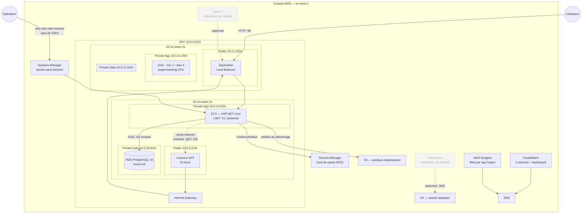
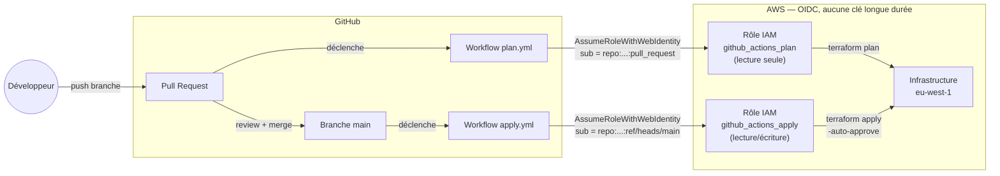

# Diagramme d'architecture

Diagrammes en [Mermaid](https://mermaid.js.org/) (diagramme-as-code, rendu
natif sur GitHub) — cohérent avec une infrastructure elle-même entièrement
décrite en code. Reflète l'état **réellement déployé** en `eu-west-1`
(profil économique par défaut) ; les composants désactivés par défaut
(WAF, CloudFront) sont marqués comme tels, pas omis.

## Architecture réseau et applicative



**Trois tiers de subnets** (public / privé applicatif / privé données),
2 AZ — cf. [ADR-001](../adr/001-nat-mode-variable.md) pour le choix de
l'instance NAT plutôt qu'une NAT Gateway managée, et
[ADR-002](../adr/002-region-eu-west-1.md) pour le choix de la région.

## Pipeline CI/CD



Détail des deux rôles et du scoping IAM :
[ADR-003](../adr/003-cicd-oidc-deux-roles.md).

## Sources

Fichiers `.mmd`/`.md` de ce dossier = source de vérité. Pour exporter en
PNG/SVG (ex. pour une présentation) :

```bash
npx -y @mermaid-js/mermaid-cli -i docs/diagrams/architecture.md -o docs/diagrams/architecture.png
```
